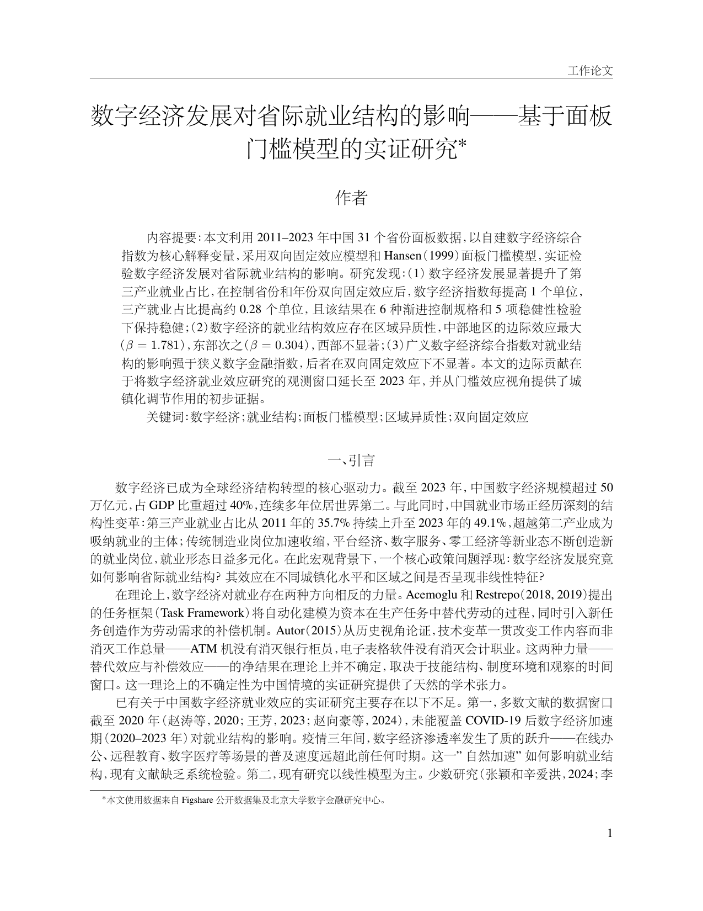
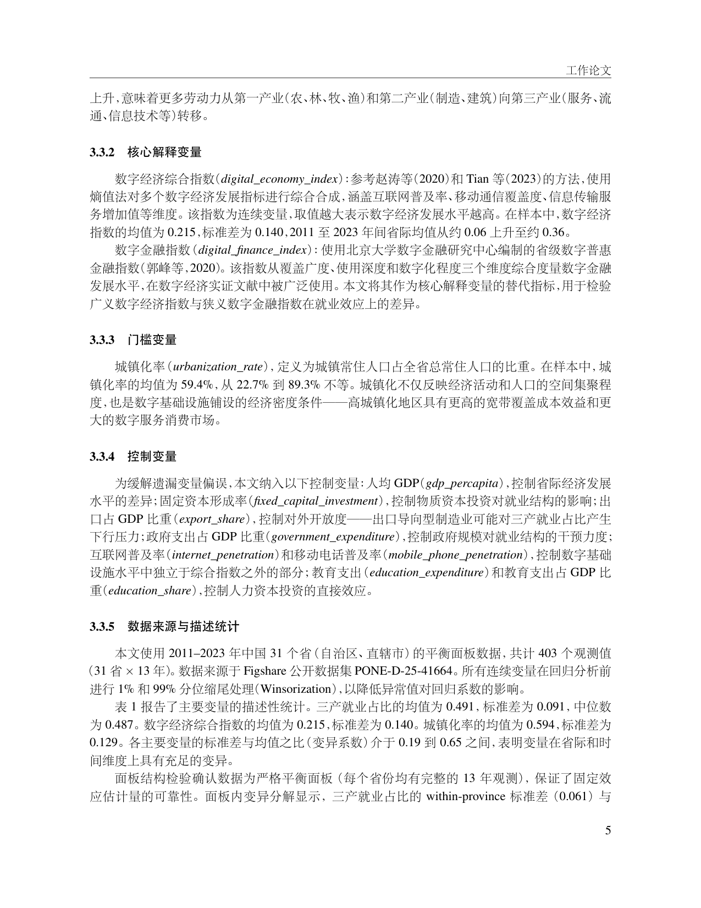
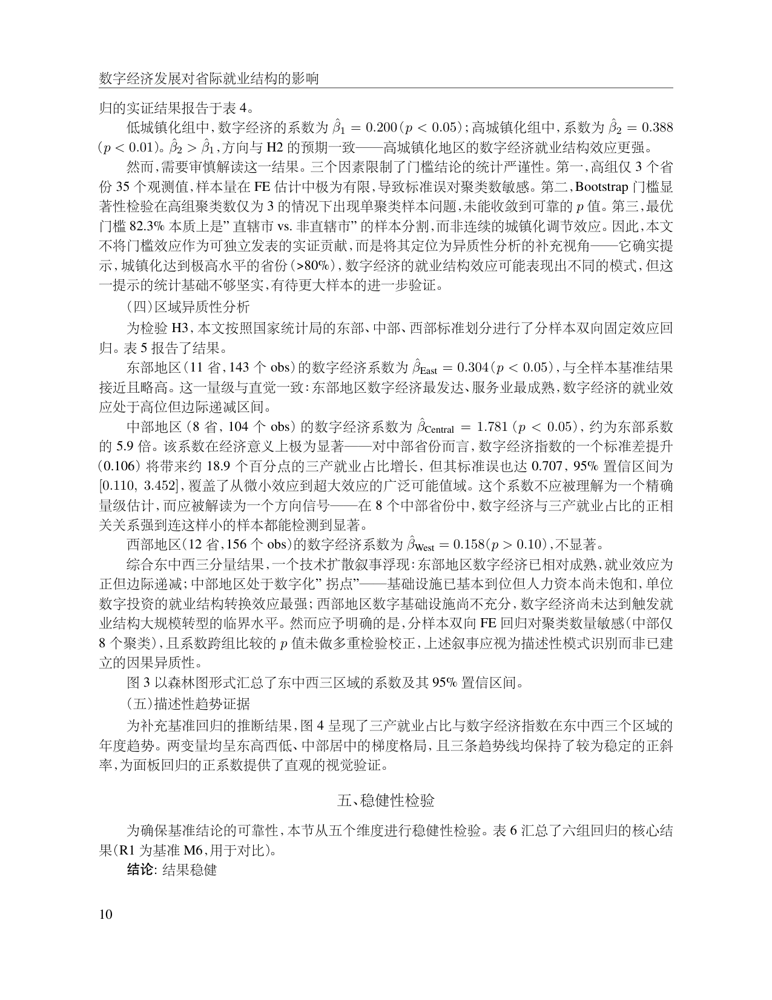

# PaperPilot

> 安装到你的 AI 编程助手后，它立即具备学术论文全流程研究能力——从选题发散、文献搜索、案例分析到论文排版。面向人文社科（经济学、管理学、公共政策等）的案例研究与学术论文写作。

[](LICENSE)
[](https://www.python.org/)

---

## 致谢与依赖

PaperPilot 的学术搜索能力由 [paper-search-mcp](https://github.com/openags/paper-search-mcp) 提供，覆盖 arXiv、Semantic Scholar、PubMed、Crossref、SSRN 等 20+ 学术数据库，免费且无需 API Key 即可使用。联网与数据获取能力基于 [web-access](https://github.com/eze-is/web-access) 构建，提供搜索策略调度、网页抓取与文件下载。感谢以上项目作者的开源贡献。

环境要求：Python 3.11+，Node.js 18+（MCP 运行时），TeX Live（可选，编译论文 PDF）。

---

## Demo

以下是 PaperPilot 辅助完成的示例论文（完整产出见 `demo/` 目录）：

<p align="center">
  
  
  
</p>
<p align="center"><em>《数字经济发展对省际就业结构的影响》—— 从选题到《经济研究》格式排版均由 PaperPilot 辅助完成</em></p>

---

## 安装

### 方式一：一键脚本

```bash
bash <(curl -fsSL https://raw.githubusercontent.com/DGU-stallion/PaperPilot/main/install.sh)
```

### 方式二：让你的 Agent 安装

将这段话发给你的 AI 编程助手：

```
请为我安装 PaperPilot：https://github.com/DGU-stallion/PaperPilot
读取 AGENT_INSTALL.md 完成安装和搜索能力配置，然后引导我开始。
```

安装脚本会自动检测你使用的 Agent 平台（Claude Code / Kiro / Cursor / Codex / OpenCode），生成对应的配置文件，无需手动适配。

---

## 使用方式

1. 为你的论文创建一个独立文件夹，或者进入已有的论文项目目录
2. 在该目录中启动你的 AI 编程助手
3. 用自然语言描述你的需求，PaperPilot 会自动激活

你也可以通过 `/paperpilot` 命令手动触发 PaperPilot，查看当前项目状态或选择要执行的研究阶段。

PaperPilot 会在当前目录下按约定组织产出文件：

```
my-paper/
├── topics/          研究方案
├── literature/      文献搜索与综述
├── data/            数据与证据
├── analysis/        实证分析
├── paper/           论文正文
├── audit/           审查报告
└── researcher_profile.json
```

当 PaperPilot 仓库通过 `git pull` 更新后，你的项目下次启动 Agent 时自动获取最新能力。

---

## 设计哲学

**导师而非工具。** PaperPilot 不等指令。它主动判断方向可行性、报告风险、在你走偏时拉回来。它模拟的是一个好导师的思维模式：先了解你在哪里，再决定带你去哪里。新手得到详细解释，有经验者得到干净的选项。

**证据链可追溯。** 每一个结论都必须有出处。LLM 生成的内容绝不标记为"已验证"，搜索结果必须附带判断而非罗列。学术诚信不是事后检查，而是从第一步嵌入流程。

**搜索后给判断。** 不做信息搬运工。搜到 50 篇文献不是交付，告诉你"这个方向已经饱和、你的差异化可能在 X"才是交付。每次搜索结束后给出方向性判断和可操作建议。

**渐进式复杂度。** 用同一套系统服务从零开始的本科生和正在改稿的博士生。系统根据你的阶段、经验和当前想法成熟度动态调整引导深度，不用一种方式对所有人说话。

---

## 架构

```
[PaperPilot]  ← 论文领航员：用户画像 + 状态诊断 + 搜索策略 + 流程编排
   │
   ├── topic-explorer        选题探索（发散-收敛 → 研究计划书）
   ├── paper-search          文献搜索（锚点深搜 → 验证 → 清单 + .bib）
   ├── literature-review     文献综述（主题提炼 → 结构规划 → 成文）
   ├── data-collector        案例证据搜集（多源交叉验证 + 事件时间线）
   ├── paper-writer          论文写作（学位论文结构 + 规范排版 + AI 痕迹消除）
   └── integrity-auditor     学术审查（引用验证 + 论据事实一致性）
```

各 Skill 之间没有固定顺序，按用户当前需求调用。每个 Skill 完成后返回产出评价、下一步建议和风险提示。

---

## Skill 能力

| Skill | 做什么 | 产出 |
|-------|--------|------|
| topic-explorer | 从模糊兴趣出发，通过发散-收敛对话确定选题、研究问题、Through-line | `research_proposal.md` |
| paper-search | 基于锚点论文向外扩展搜索，验证每条引用真实性，构建参考文献清单 | `paper_search.md` + `.bib` |
| literature-review | 从文献清单中提炼主题、识别争论和空白，写出结构化综述 | `literature_review.md` |
| data-collector | 定位案例材料（年报/公告/研报/政策）、评估可得性、多源三角验证、构建时间线 | `data_report.md` + 案例素材 |
| paper-writer | 按目标期刊或高校学位论文格式组装论文，检查 AI 写作痕迹，编译 PDF | `main.tex` + PDF |
| integrity-auditor | 逐条验证引用、核对正文事实与案例证据一致性 | `audit_report.md` |

---

## 搜索能力

| 层级 | 工具 | 用途 |
|------|------|------|
| 学术文献 | paper-search-mcp | 20+ 数据库精确检索，免费 |
| 信息侦察 | web-access | 选题验证、政策背景、数据源定位 |
| 兜底 | Agent 内置搜索 | 无需配置，基础可用 |

---

## 项目结构

```
PaperPilot/
├── AGENTS.md             # 元技能规范（所有 Agent 的统一入口）
├── CLAUDE.md             # Claude Code 入口
├── AGENT_INSTALL.md      # 安装契约
├── install.sh            # 一键安装脚本
├── skills/               # 技能包
│   ├── topic-explorer/
│   ├── paper-search/
│   ├── literature-review/
│   ├── data-collector/
│   ├── paper-writer/
│   ├── integrity-auditor/
│   └── web-access/
├── scripts/              # Python 后端
├── demo/                 # 示例论文（展示完整产出）
└── install/              # 安装与诊断脚本
```

---

## 许可证

MIT License. 详见 [LICENSE](LICENSE).
